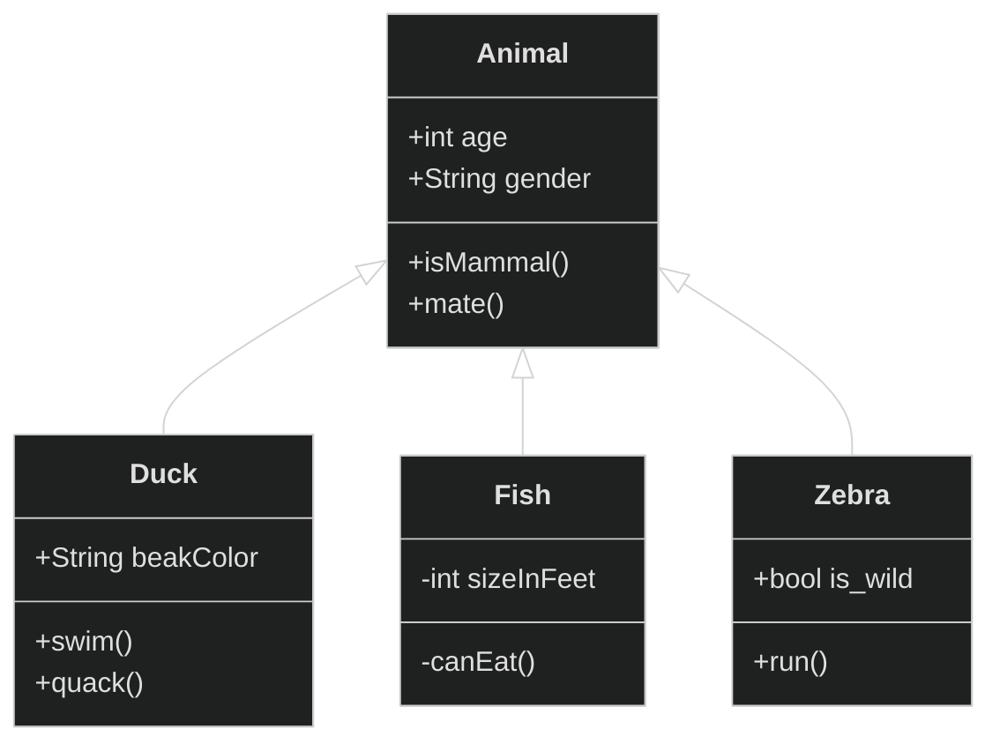
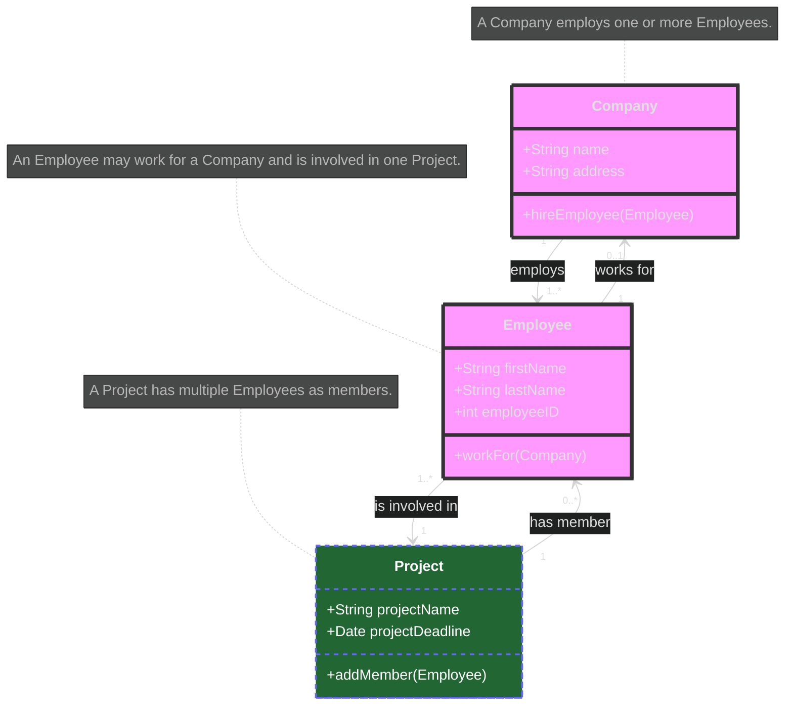
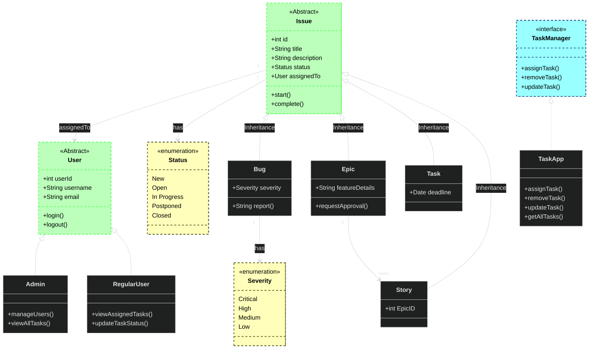

#review 

//www.mermaidchart.com/app/
# 1. A class sequence diagram with inheritance

# 1. A class diagram using cardinalities

# 2. Class schema for an issue tracking system with inheritance and interfaces

