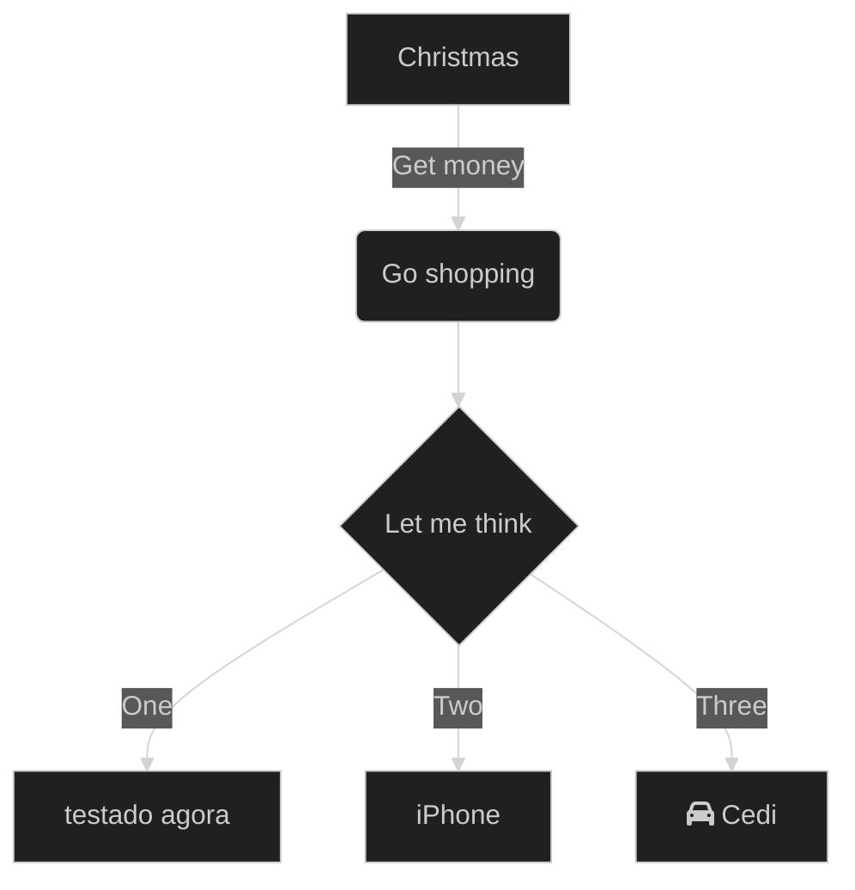
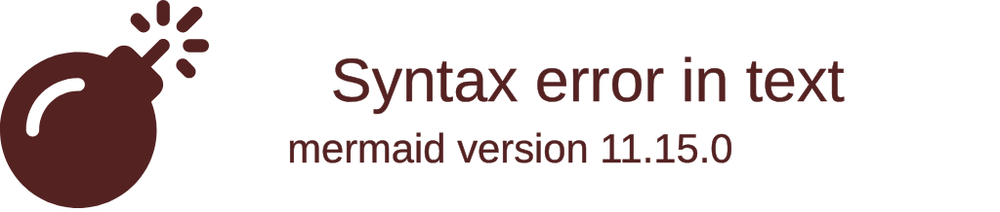

```mermaid
---
config: 
 theme: 'dark'
---
flowchart TD
    A[Christmas] -->|Get money| B(Go shopping)
    B --> C{Let me think}
    C -->|One| D[testado agora ]
    C -->|Two| E[iPhone]
    C -->|Three| F[fa:fa-car Cedi]
```
  ---

```mermaid
---
config:
  treeView:
    showIcons: true
    defaultIconPack: material-icon-theme
    filenameIcons:
      Dockerfile: docker
    extensionIcons:
      .ts: typescript
      .tsx: react-ts
      .txt: none
---

treeView-beta
    src/
        App.tsx
        utils.ts
    Dockerfile
    notes.txt
    README.md

```

