#review 

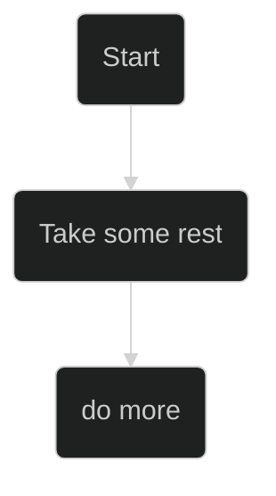

[Mermaid Theming](https://mermaid.js.org/config/theming.html)

# 1. Mermaid Theme List

base (único tema personalizável)

dark

default

forest

mc

neo

neo-dark

neutral

# Visão TODO
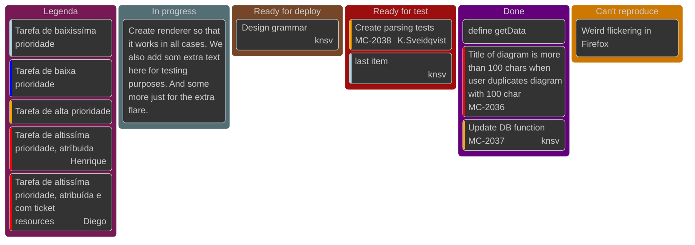

Os links infelizmente não funcionam como deveriam. No github não apresentam função. Por hora a frustração foi suficiente para criar camadas de distração. Vou tentar procurar alternativa com o gpt.

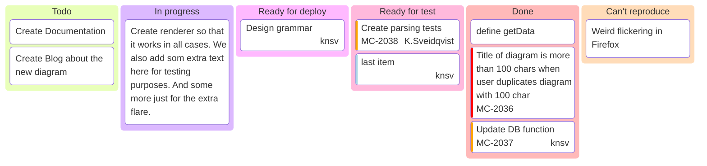

O gpt sugeriu usar uma lista de links abaixo do kanban. E tentar a opção com `graph TD`. Ambos códigos que o chatgpt gerou não estão de acordo. O segundo do tipo `graph td` renderizou mas os links não funcionam


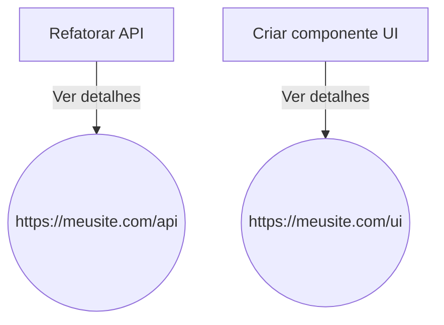

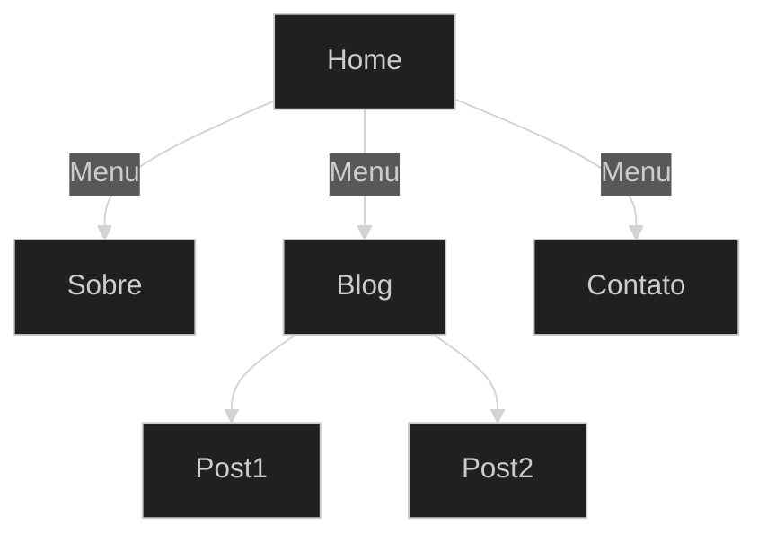

## Fluxo de usuário
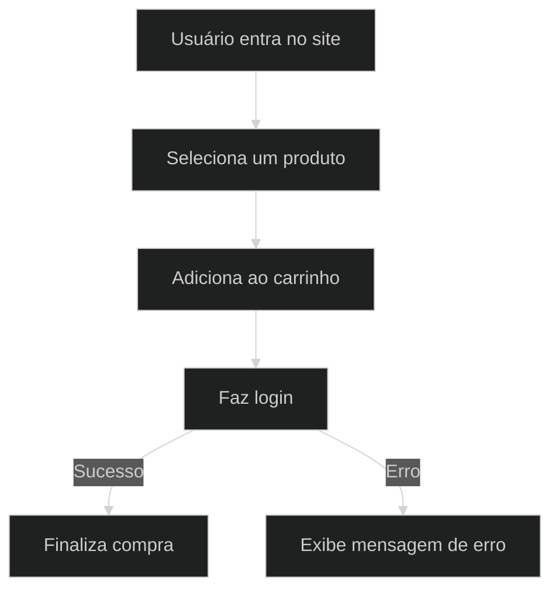

# Diagrama de banco de Dados

A melhor opção até aqui.

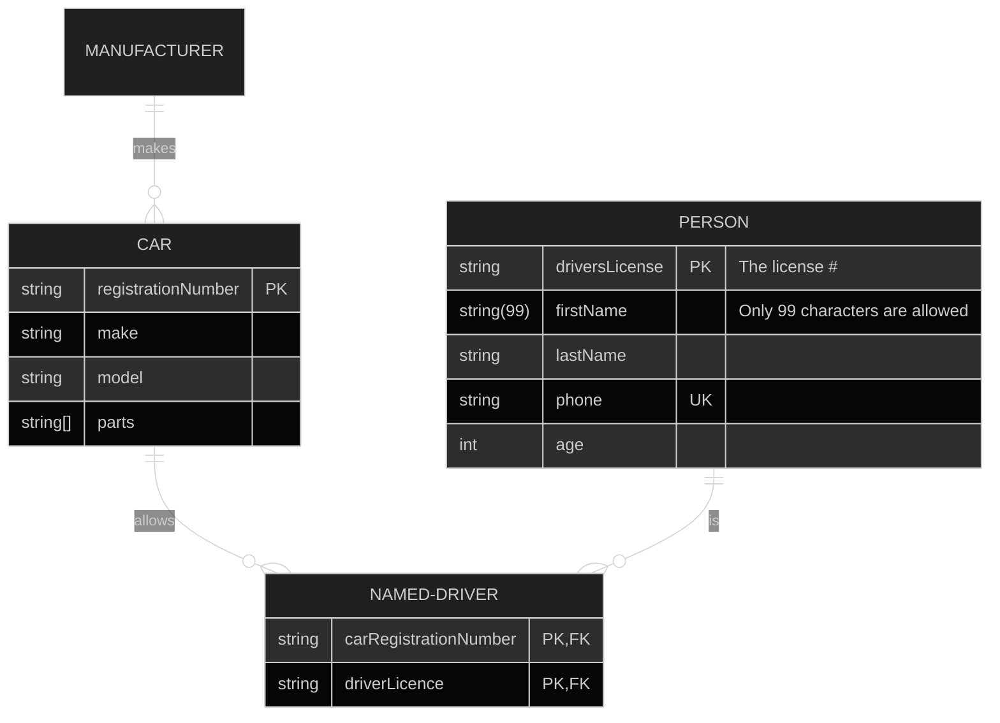

# Opções para planejar atividades

## Diagrama de Fluxo

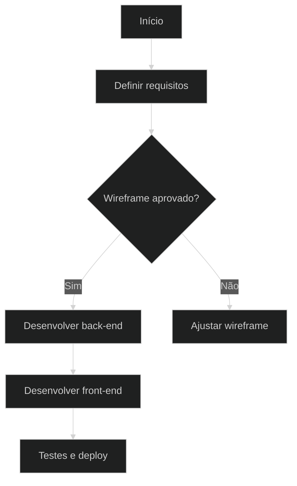

## Diagrama de estado

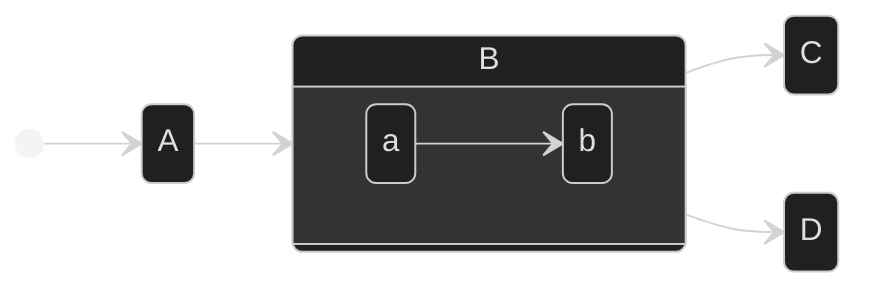

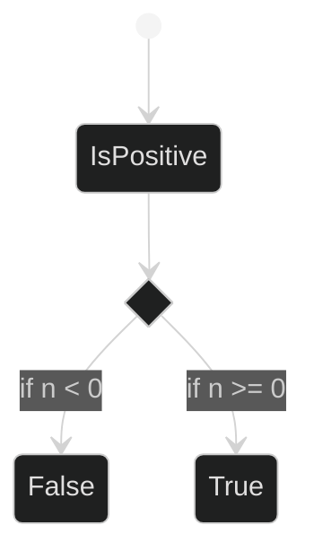

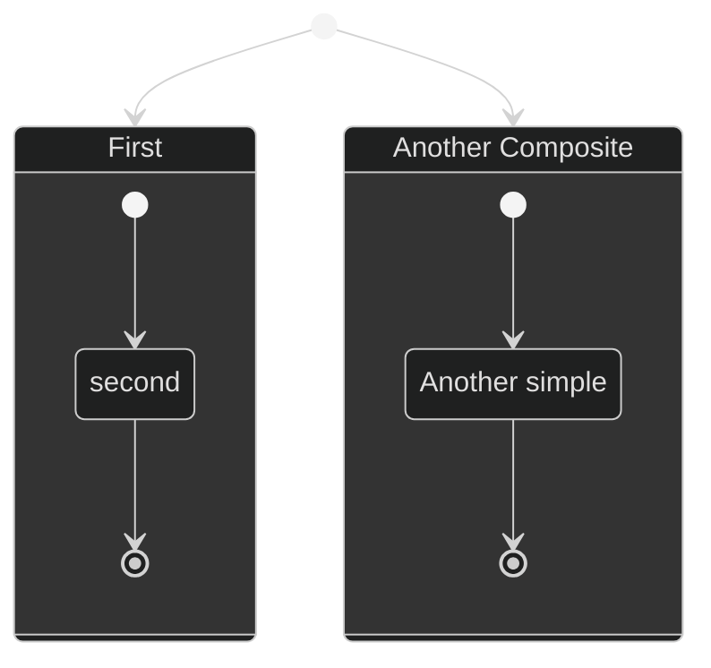

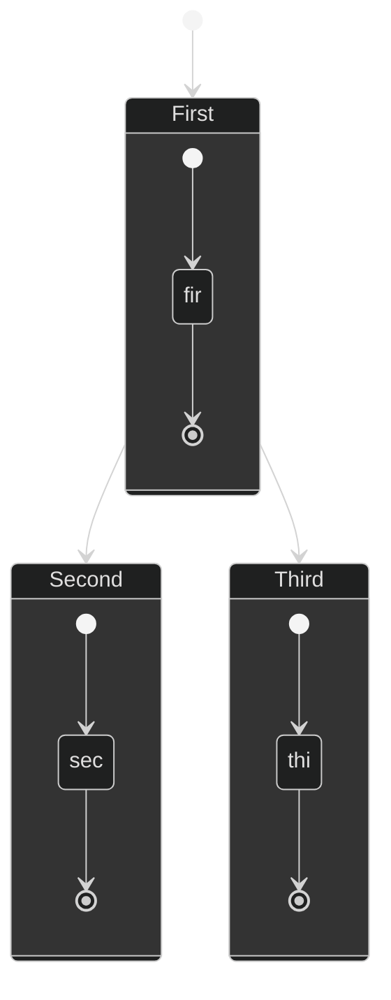
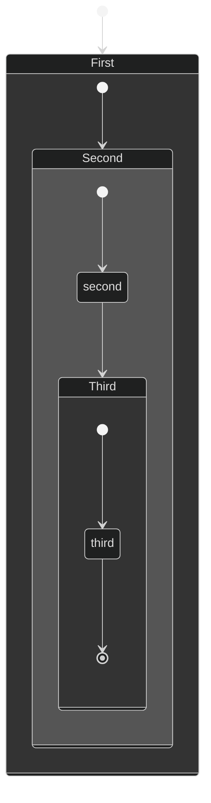

```
# 1. Backlog
now is 5:45 the time will go to 5:50 a moment of push


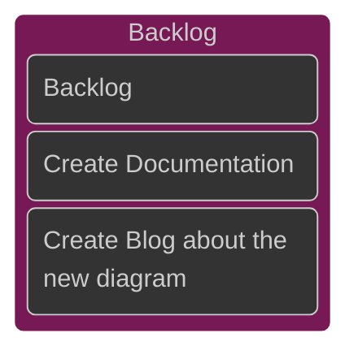

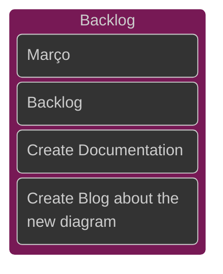
## Como configurar a base de modo customizado
```text

%%{
  init: {
    'theme': 'base',
    
    
    'themeVariables': {
    
      'primaryColor': '#0d0da2',
      Cor da célula da tarefa 
  
      'primaryTextColor': '#ffffff',
      Cor do texto
      
      'primaryBorderColor': '#4000ff',
      Bordas das celulas 
      
      'lineColor': '#ffffff',
      Não se aplica porque não há linhas
      
      'secondaryColor': '#000000',
      Não se aplica

      'tertiaryColor': '#0d0da2'
      Cor do quadrado de fundo maior.
    }
  }
}%%

```
# 2. Objetivo

# 3. Foco
# 4. Pronto para Deploy

# 5. Pronto para Teste

# 6. Concluído
# 7. Visão 3x3

ToDo, in progress, ready for deploy, ready for test, done, Can't reproduce

1.
2.
3.
4.

Adicionar e testar links (que podem levar ao numero da requisição exemplo: #001, #002, #003, #004, #005, etc)

Usar as indicações de prioridade (low, medium, high)
# Gantt
Mês dividido em 4 semanas. Adaptar este gráfico

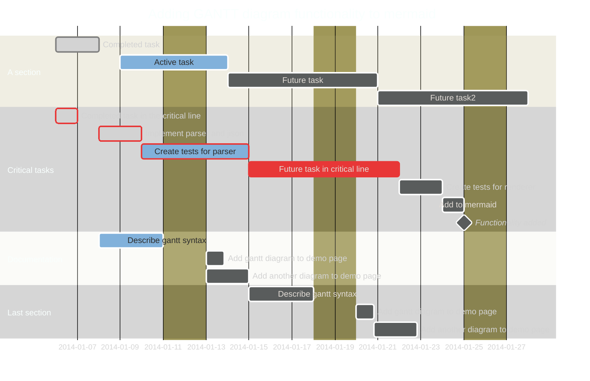
